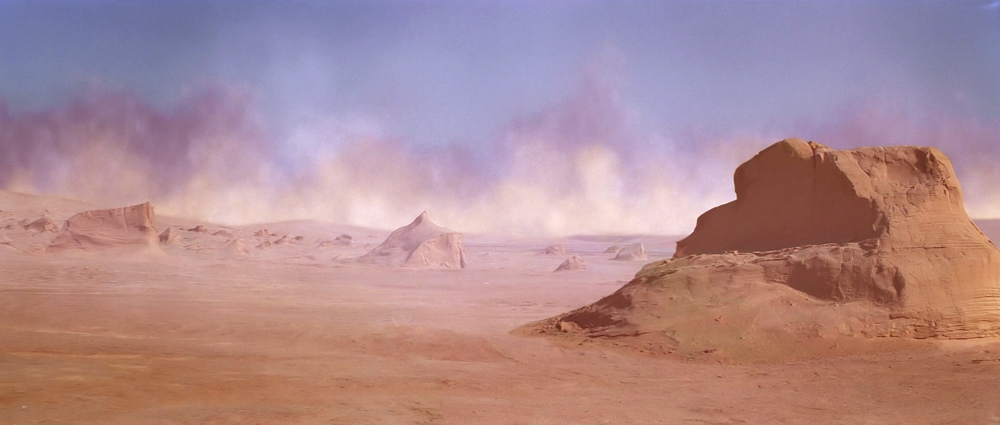
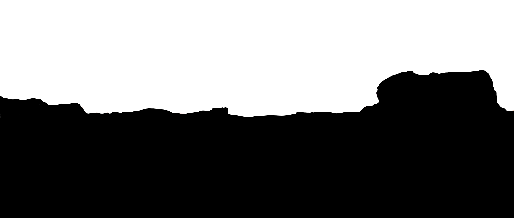

# Image-to-Cinemagrph
The goal of this work is to generate an animation out of your input image, it is still under active development.

The code was written by [Ma'ayan Shuvi](https://mShuvi.github.io/) under supervision of [Kfir Aberman](https://kfiraberman.github.io/).

Our goal is to generate a Cinemagraph, which contains natueral subtle motion, out of a signle input image.
- Given input image and its binary map:<br />
     


- The output video:<br />
    <p align="center">
      
    </p>
       
- The original output filel is in .mp4 format, can be found [here](https://github.com/mShuvi/Image-to-Cinemagrph/blob/master/imgs/looped_video.mp4).       

## Prerequisites
- Python 2 or 3


### Run Demo
- Run the algorithm (demo example) in order to get Sandstorm animation
```bash
#!./script.sh
python3 main.py
```    


### Run on your own Image
- Save your image 
- Generate a binary map, '1' - defines the motion region and '0' defines the static region. (tip: can be created even with Paint)
- generate Strokes text file. Each line represent the start point and end point of one strokes.
Example: start_x, start_y, end_x, end_y
Attention: in images x - top to bottom, y - left to right.
- You can edit the parameters of you model:
```bash
--project_name <name of project>
--img_path <path to input image>
--work_dir <path the dir which will include the project dir>
--binary_map_path <path binary map of the input image>        
--storkes_txt_path <path to txt which include strokes om motion>
    
--updatebinarymap, action='store_true', help='if specified, add static edges to binary map in field calculation.   
--H , type=int, default=153, help='scale input image to this height.
--W, type=int, default=360, help='scale input image to this width.
        
--warping_field_alpha, type=float, default=0.5, help=# of input image channels.
--th, type=int, default=0.5, help=Binarymap threshold for input binarymap (RGB to binary image).                            
 --alpha_exp, type=float, default=0.001, help=controls the interpolation in field generation.                            
--no_original_vid, action='store_true', help=if specified, create a video of frames without hallucination effect.    

--nSegments, type=int, default=20, help=number of frames in output video.
--fps, type=int, default=15, help=frames per sec. of output video
----plot_step, type=int, default=5, help=number of steps between field plot samples.
 ```

### Examples:
- Tower exmple, its input image and binary map is attached. You can create you own motion strokes and animate the image!<br />
    <p align="center">
      
    </p>
    
- Water motion, we tried to imitate a motion of a given video, given its first frame only. (right: original, left: our animation)<br />
    <p align="center">
      
    </p>
